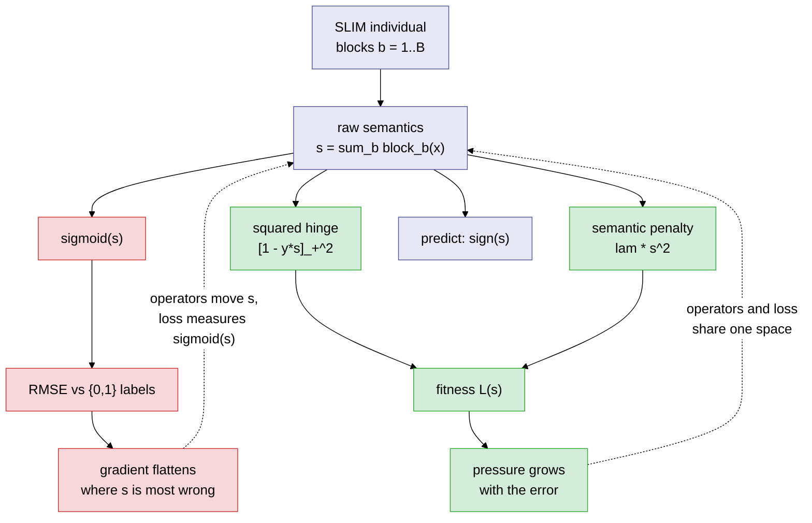
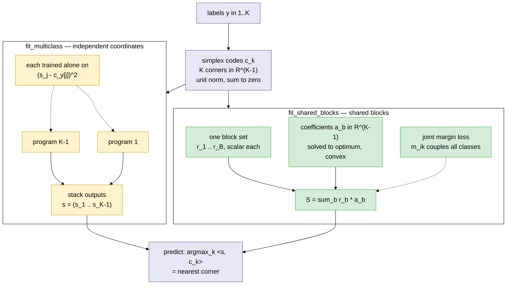

# SLIM (Semantic Learning algorithm based on Inflate and deflate Mutation)

`slim_gsgp` is a Python library that implements the SLIM algorithm, which is a variant of the Geometric Semantic Genetic Programming (GSGP). This library includes functions for running standard Genetic Programming (GP), GSGP, and all developed versions of the SLIM algorithm. Users can specify the version of SLIM they wish to use and obtain results accordingly. Slim's documentation can be accessed in [Slim Documentation](https://slim-library.readthedocs.io/en/latest/). Users looking to extend `slim_gsgp` can refer to the [Developer Tutorial](CONTRIBUTING.md) for further guidance.

`slim_gsgp` requires Python >=3.10.


## Installation

To install the library, use the following command:
```sh
pip install slim_gsgp
```

## Usage
### Running GP 
To use the GP algorithm, you can use the following example:

```python
from slim_gsgp.main_gp import gp  # import the slim_gsgp library
from slim_gsgp.datasets.data_loader import load_ppb  # import the loader for the dataset PPB
from slim_gsgp.evaluators.fitness_functions import rmse  # import the rmse fitness metric
from slim_gsgp.utils.utils import train_test_split  # import the train-test split function

# Load the PPB dataset
X, y = load_ppb(X_y=True)

# Split into train and test sets
X_train, X_test, y_train, y_test = train_test_split(X, y, p_test=0.4)

# Split the test set into validation and test sets
X_val, X_test, y_val, y_test = train_test_split(X_test, y_test, p_test=0.5)

# Apply the GP algorithm
final_tree = gp(X_train=X_train, y_train=y_train,
                X_test=X_val, y_test=y_val,
                dataset_name='ppb', pop_size=100, n_iter=100)

# Show the best individual structure at the last generation
final_tree.print_tree_representation()

# Get the prediction of the best individual on the test set
predictions = final_tree.predict(X_test)

# Compute and print the RMSE on the test set
print(float(rmse(y_true=y_test, y_pred=predictions)))
```

### Running standard GSGP 
To use the GSGP algorithm, you can use the following example:

```python
from slim_gsgp.main_gsgp import gsgp  # import the slim_gsgp library
from slim_gsgp.datasets.data_loader import load_ppb  # import the loader for the dataset PPB
from slim_gsgp.evaluators.fitness_functions import rmse  # import the rmse fitness metric
from slim_gsgp.utils.utils import train_test_split  # import the train-test split function


# Load the PPB dataset
X, y = load_ppb(X_y=True)

# Split into train and test sets
X_train, X_test, y_train, y_test = train_test_split(X, y, p_test=0.4)

# Split the test set into validation and test sets
X_val, X_test, y_val, y_test = train_test_split(X_test, y_test, p_test=0.5)

# Apply the Standard GSGP algorithm
final_tree = gsgp(X_train=X_train, y_train=y_train,
                  X_test=X_val, y_test=y_val,
                  dataset_name='ppb', pop_size=100, n_iter=100,
                  reconstruct=True, ms_lower=0, ms_upper=1)

# Get the prediction of the best individual on the test set
predictions = final_tree.predict(X_test)

# Compute and print the RMSE on the test set
print(float(rmse(y_true=y_test, y_pred=predictions)))
```

### Running SLIM 
To use the SLIM GSGP algorithm, you can use the following example:

```python
from slim_gsgp.main_slim import slim
from slim_gsgp.datasets.data_loader import load_breast_cancer
from slim_gsgp.utils.utils import train_test_split
from slim_gsgp.evaluators.fitness_functions import binary_sign_transform

# Load a binary classification dataset
X, y = load_breast_cancer(X_y=True)

# Split into train, validation and test sets
X_train, X_test, y_train, y_test = train_test_split(X, y, p_test=0.4)
X_val, X_test, y_val, y_test     = train_test_split(X_test, y_test, p_test=0.5)

# Apply SLIM with sigmoid_rmse for binary classification
final_tree = slim(
    X_train=X_train, y_train=y_train,
    X_test=X_val,   y_test=y_val,
    dataset_name='breast_cancer',
    slim_version='SLIM+ABS', pop_size=100, n_iter=100,
    ms_lower=0, ms_upper=1, p_inflate=0.5,
    fitness_function='sigmoid_rmse',
    sigmoid_scaling_factor=1.0,
)

# Show the best individual structure at the last generation
final_tree.print_tree_representation()

# Get predictions and convert raw outputs to binary labels (negative -> 0, non-negative -> 1)
predictions = binary_sign_transform(final_tree.predict(X_test))

# Compute accuracy (no external dependencies required)
acc = float((predictions == y_test).float().mean())
print(f"Accuracy: {acc:.4f}")
```

### Classification with MS-SLIM (margin loss)

For a concise description of the method, implementation limits, and the core
SLIM speed and memory changes, see
[`MS_SLIM_overview.md`](MS_SLIM_overview.md).

`sigmoid_rmse` above squashes raw outputs through a sigmoid before measuring
error. The sigmoid saturates where a program is most wrong, so the search feels
almost no pressure exactly there. **MS-SLIM** removes the sigmoid and measures a
squared-hinge margin directly on the raw semantics the operators already move:

```
L(s) = mean( [1 - y*s]_+^2 + lam * s^2 ),   y in {-1, +1}
```

The mismatch this removes: inflate and deflate move the **raw** semantics, but
the sigmoid path measures error on the **squashed** ones, so the two operate in
different spaces.



Red is the `sigmoid_rmse` path, green is MS-SLIM. Both start from the same raw
`s`, but only MS-SLIM scores it in the space the operators actually change.
`lam > 0` pins the optimum at `s* = y / (1 + lam)`.

Pick a technique with `get_strategy`, which binds the label encoding, the
fitness function, and the prediction decoding together so they cannot be
mismatched:

```python
from slim_gsgp.main_slim import slim
from slim_gsgp.datasets.data_loader import load_breast_cancer
from slim_gsgp.utils.utils import train_test_split
from slim_gsgp.classification import get_strategy

X, y = load_breast_cancer(X_y=True)
X_train, X_test, y_train, y_test = train_test_split(X, y, p_test=0.4)
X_val,   X_test, y_val,   y_test = train_test_split(X_test, y_test, p_test=0.5)

strategy = get_strategy("margin")          # or "logistic", "code_regression", "sigmoid_rmse"

model = slim(
    X_train=X_train, y_train=strategy.encode(y_train),
    X_test=X_val,    y_test=strategy.encode(y_val),
    dataset_name="breast_cancer",
    slim_version="SLIM+ABS", pop_size=100, n_iter=100,
    fitness_function=strategy.fit_string,
    lam=0.01,                              # semantic regularization strength
)

predictions = strategy.decode(model.predict(X_test))
accuracy = float((predictions == strategy.encode(y_test)).float().mean())
print(f"Accuracy: {accuracy:.4f}")
```

Available strategies:

| Name | Fitness | Labels | Purpose |
|---|---|---|---|
| `margin` | `[1 - y*s]_+^2 + lam*s^2` | `{-1,+1}` | MS-SLIM |
| `logistic` | `log(1 + exp(-y*s))` | `{-1,+1}` | raw-score baseline |
| `code_regression` | `(y - s)^2` | `{-1,+1}` | isolates the hinge |
| `sigmoid_rmse` | `RMSE(sigmoid(s), y)` | `{0,1}` | Bakurov et al. (2022) |

`lam > 0` gives the loss a unique optimum at `s* = y / (1 + lam)`. It bounds the
semantic magnitude only — it is **not** a program-size penalty; deflate remains
the size-control mechanism.

### Adaptive inflate

Because the margin loss is convex and inflate is affine in its mutation step,
the best mutation step for a new block is solved exactly instead of guessed.
Pass `use_adaptive_inflate=True` (requires `fitness_function="margin"`). It
works for additive `SLIM+` and opt-in multiplicative `SLIM*` variants; the
published random-step variants are unchanged by default:

```python
model = slim(
    X_train=X_train, y_train=strategy.encode(y_train),
    X_test=X_val,    y_test=strategy.encode(y_val),
    dataset_name="breast_cancer", slim_version="SLIM+ABS",
    pop_size=100, n_iter=100,
    fitness_function="margin", lam=0.01,
    use_adaptive_inflate=True,
)
```

### Multiclass classification

Classes are placed at the corners of a regular simplex, and a prediction is the
nearest corner. Two architectures are provided.



Both share the class geometry and the prediction rule; they differ in what they
evolve and what they optimize. Independent coordinates train each program on
plain squared error, because the hinge has no per-coordinate form — the margin
`m_ik` is joint across all K-1 coordinates at once. Shared blocks optimize that
joint objective directly.

**Independent coordinates** — evolves K-1 separate programs, one per simplex
coordinate. Simple and fast; it reproduces MS-SLIM's class geometry and
prediction rule, but trains each coordinate with plain squared error, so it does
**not** optimize the joint margin objective:

```python
import torch
from sklearn.datasets import load_iris
from slim_gsgp.utils.utils import train_test_split
from slim_gsgp.classification import fit_multiclass

data = load_iris()
X = torch.tensor(data.data, dtype=torch.float32)
y = torch.tensor(data.target, dtype=torch.float32)

X_train, X_test, y_train, y_test = train_test_split(X, y, p_test=0.3, seed=0)
X_train, X_val,  y_train, y_val  = train_test_split(X_train, y_train, p_test=0.25, seed=0)

model = fit_multiclass(X_train, y_train, X_val, y_val,
                       pop_size=100, n_iter=30, slim_version="SLIM+ABS",
                       log_level=0, verbose=0, seed=0)

accuracy = float((model.predict(X_test) == y_test).float().mean())
print(f"Accuracy: {accuracy:.4f}")
```

**Shared blocks** — one set of symbolic blocks serves every class, each with its
own coefficient vector (`P(x) = sum_b r_b(x) * a_b`). This optimizes the true
joint margin objective, in which the classes are coupled:

```python
from slim_gsgp.classification import fit_shared_blocks

model = fit_shared_blocks(X_train, y_train,
                          slim_version="SLIM+ABS", pop_size=100, n_iter=30,
                          lam=0.01, seed=0, verbose=1)

accuracy = float((model.predict(X_test) == y_test).float().mean())
print(f"Accuracy: {accuracy:.4f}  blocks: {model.individual.size}")
```

Shared blocks require an additive (`SLIM+`) variant and raise `ValueError` otherwise:
the representation needs semantics linear in the coefficients, and a multiplicative
operator collapses blocks with `prod`. Binary MS-SLIM and `fit_multiclass` carry no
such constraint and run on all six variants.

MS-SLIM produces scores and margins, not calibrated probabilities.

### Running experiments

`run_binary_config` trains and scores one strategy on one seed, deriving a
stratified train/validation/test split from that seed alone — so the same seed
gives every strategy the identical split and results are directly paired:

```python
import pandas as pd
from slim_gsgp.classification.campaign import run_binary_config

results = pd.concat([
    pd.DataFrame([
        run_binary_config("breast_cancer", name, seed=seed,
                          pop_size=100, n_iter=100,
                          slim_version="SLIM+ABS", lam=0.01)
        for seed in range(20)
    ])
    for name in ("margin", "logistic", "sigmoid_rmse")
], ignore_index=True)

print(results.groupby("method")[["accuracy", "balanced_accuracy", "mcc", "auroc"]].mean())
```

Each row carries accuracy, balanced accuracy, F1, MCC, AUROC, AUPRC, node count,
block count and both timings; margin runs additionally report the semantic norm
and margin statistics. `paired_comparison` turns those rows into Wilcoxon tests
with Holm correction and effect sizes.

A runnable tour of everything above ships with the package:

```bash
python -m slim_gsgp.classification.example_classification
```

For the full experimental campaign behind the MS-SLIM manuscript — benchmark
datasets, the five research questions, paired statistics — see
[`MS_SLIM_runbook.md`](MS_SLIM_runbook.md):

```bash
python -m slim_gsgp.classification.campaign --question all --seeds 20 --out results/
```


## License

This library is [MIT licensed](https://github.com/DALabNOVA/slim?tab=MIT-1-ov-file).

The datasets provided are public. The table below specifies the source and license of each dataset.

| Datset                                            | Source                                                                | License                                                    |
|---------------------------------------------------|-----------------------------------------------------------------------|------------------------------------------------------------|
| airfoil                                           | [UCI Machine Learning Repository](https://archive.ics.uci.edu/dataset/291/airfoil+self+noise)        | Creative Commons Attribution 4.0 International (CC BY 4.0) |
| bike sharing                                      | [UCI Machine Learning Repository](https://archive.ics.uci.edu/dataset/275/bike+sharing+dataset)          | Creative Commons Attribution 4.0 International (CC BY 4.0) |
| bioavailability                                   | F. Archetti et al. (2007)*                                            | Unknown |
| breast cancer                                     | [UCI Machine Learning Repository](https://archive.ics.uci.edu/dataset/14/breast+cancer)                  | Creative Commons Attribution 4.0 International (CC BY 4.0) |
| concrete slump                                    | [UCI Machine Learning Repository](http://archive.ics.uci.edu/dataset/182/concrete+slump+test)            | Creative Commons Attribution 4.0 International (CC BY 4.0) |
| concrete strength (different number of instances) | [UCI Machine Learning Repository](https://archive.ics.uci.edu/dataset/165/concrete+compressive+strength) | Creative Commons Attribution 4.0 International (CC BY 4.0) |
| diabetes                                          | [UCI Machine Learning Repository](https://www4.stat.ncsu.edu/~boos/var.select/diabetes.html)             | CC0 License                                                |
| efficiency_cooling                                | [UCI Machine Learning Repository](https://archive.ics.uci.edu/dataset/242/energy+efficiency)             | Creative Commons Attribution 4.0 International (CC BY 4.0) |
| efficiency_heating                                | [UCI Machine Learning Repository](https://archive.ics.uci.edu/dataset/242/energy+efficiency)             | Creative Commons Attribution 4.0 International (CC BY 4.0) |
| forest_fires                                      | [UCI Machine Learning Repository](https://archive.ics.uci.edu/dataset/162/forest+fires)                  | Creative Commons Attribution 4.0 International (CC BY 4.0) |
| istanbul                                          | [UCI Machine Learning Repository](https://archive.ics.uci.edu/dataset/247/istanbul+stock+exchange)       | Creative Commons Attribution 4.0 International (CC BY 4.0) |
| ld50                                              | F. Archetti et al. (2007)*                                            | Unknown |
| parkinsons_total_UPDRS                            | [UCI Machine Learning Repository](https://archive.ics.uci.edu/dataset/189/parkinsons+telemonitoring)     | Creative Commons Attribution 4.0 International (CC BY 4.0) |
| ppb                                               | F. Archetti et al. (2007)*                                            | Unknown |
| resid_build_sale_price                            | [UCI Machine Learning Repository](https://archive.ics.uci.edu/dataset/437/residential+building+data+set) | Creative Commons Attribution 4.0 International (CC BY 4.0) |

*Archetti, F., Lanzeni, S., Messina, E., Vanneschi, L. (2007). Genetic Programming and Other Machine Learning Approaches to Predict Median Oral Lethal Dose (LD50) and Plasma Protein Binding Levels (%PPB) of Drugs. In: Marchiori, E., Moore, J.H., Rajapakse, J.C. (eds) Evolutionary Computation,Machine Learning and Data Mining in Bioinformatics. EvoBIO 2007. Lecture Notes in Computer Science, vol 4447. Springer, Berlin, Heidelberg. https://doi.org/10.1007/978-3-540-71783-6_2

## Citing 

If you use SLIM in a scientific publication, please consider citing the following papers:

```latex
@inproceedings{rosenfeld2025slimgsgp,
  author       = {Liah Rosenfeld and Davide Farinati and Diogo Rasteiro and Gloria Pietropolli and Karina Brotto Rebuli and Sara Silva and Leonardo Vanneschi},
  title        = {Slim\_gsgp: A Python Library for Non-Bloating GSGP},
  booktitle    = {Genetic and Evolutionary Computation Conference (GECCO ’25)},
  year         = {2025},
  month        = {July},
  day          = {14--18},
  address      = {Malaga, Spain},
  publisher    = {ACM},
  location     = {New York, NY, USA},
  pages        = {9},
  doi          = {10.1145/3712256.3726398},
  url          = {https://doi.org/10.1145/3712256.3726398}
}
```

```latex
@article{Vanneschi2025,
	 author = {Vanneschi, Leonardo and Farinati, Davide and Rasteiro, Diogo and Rosenfeld, Liah and Pietropolli, Gloria and Silva, Sara},
	 title = {{Exploring Non-bloating Geometric Semantic Genetic Programming}},
	 booktitle = {{Genetic Programming Theory and Practice XXI}},
	 journal = {SpringerLink},
	 pages = {237--258},
	 year = {2025},
	 month = 2,
	 isbn = {9789819600779},
	 publisher = {Springer},
	 address = {Singapore},
	 doi = {10.1007/978-981-96-0077-9_12}
}
```

```latex
@InProceedings{Vanneschi2024,
               author="Vanneschi, Leonardo",
               editor="Giacobini, Mario
               and Xue, Bing
               and Manzoni, Luca",
               title="{SLIM}{\_}{GSGP}: The Non-bloating Geometric Semantic Genetic Programming",
               booktitle="Genetic Programming",
               year="2024",
               publisher="Springer Nature Switzerland",
               address="Cham",
               pages="125--141",
               isbn="978-3-031-56957-9"
}
```


